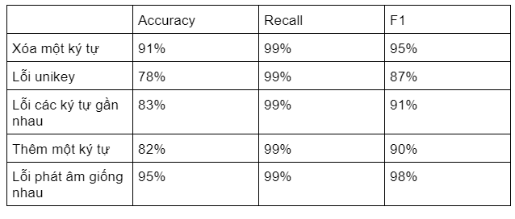

# Graduation Thesis

1. Install tool
2. Prepare Data
3. Train Model
4. Predict
5. Evaluate

## 1. Install tool
- Install python 3.7
- Install anaconda
- Install keras, tensorflow
- Install Flask, Ngrok, Fasttext, VNCoreNLP

## 2. Prepare data
- Dataset: input, output.
- Input: CharEmbedding (CharRNN).
- Output: WordEmbedding (WordRNN).
- Sentence Format: Every sentense -  (the longest number of words in the sentence, the longest number of characters in the word, number of characters possible). 
- For other sentences, if the length is not large enough, insert a padding character.
- Example: dataset(20, 11, 13, 137): 20 sentenses, each sentence has 11 words, each word has 13 characters, each character is one representing 137 characters.

## 3. Train model
-  The data I prepared is about 7000 sentences.Among 7,000 train sentences, there are 5 common Vietnamese spelling mistakes. Each sentence is tokenizer:
    đường 0 0 đường
    trần 0 0 trần
    thái 0 0 thái
    tông 0 0 tông
    trung 0 0 trung
    jhoà 0 0 hoà
    cầu 0 0 cầu
    goấy 0 0 giấy
    hà 0 0 hà
    nội 0 0 nội
On the left side are statements containing errors, on the right is the correct answer. Two character 0 0 to separate token.
- The model used is 2-dimensional bilstm. 
Reference link: https://phamdinhkhanh.github.io/2019/04/22/Ly_thuyet_ve_mang_LSTM.html

## 4. Predict
- With the data set prepared above, after being put into the model, it is over 90% precision.
- Some sentences can be corrected as follows:
  Input: ngõ 195 truhg kính trung hòa cầhu giấy hà nội
  => The model predicts the results as follows: ngõ 195 trung kính trung hòa cầu giấy hà nội.

## 5. Evaluate
- Finally, I evaluate the model from the data trained above using 3 accuracy, recall and f1 criteria.
  
 